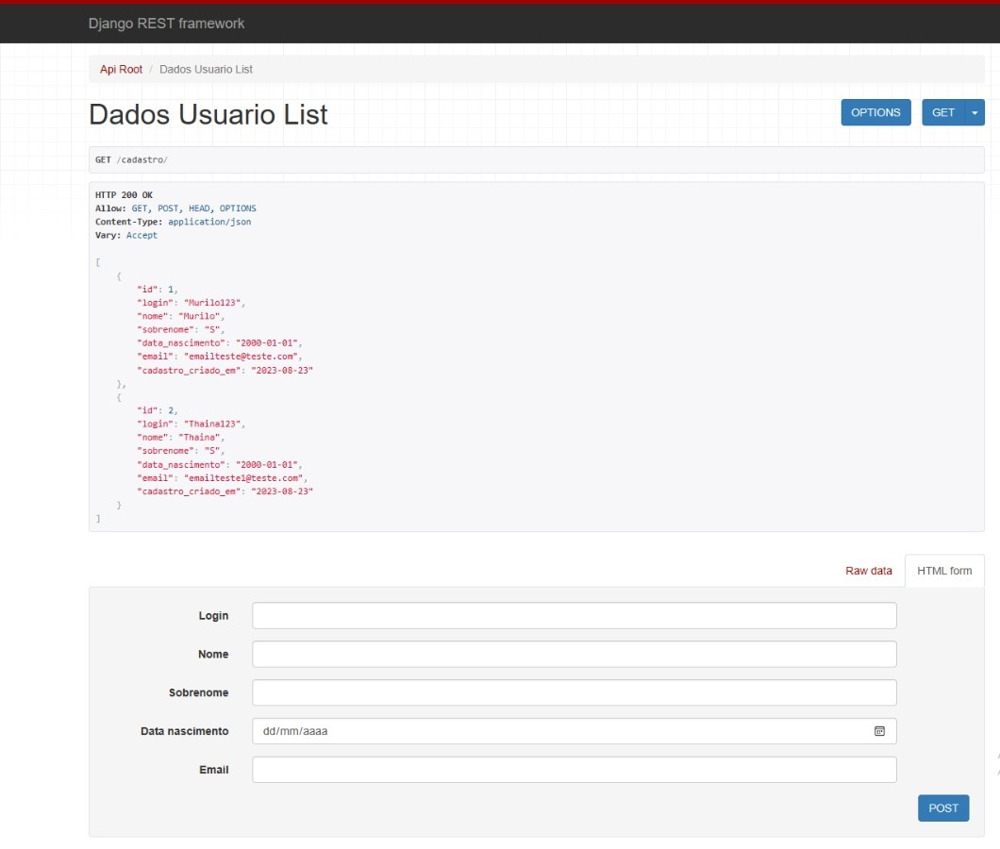
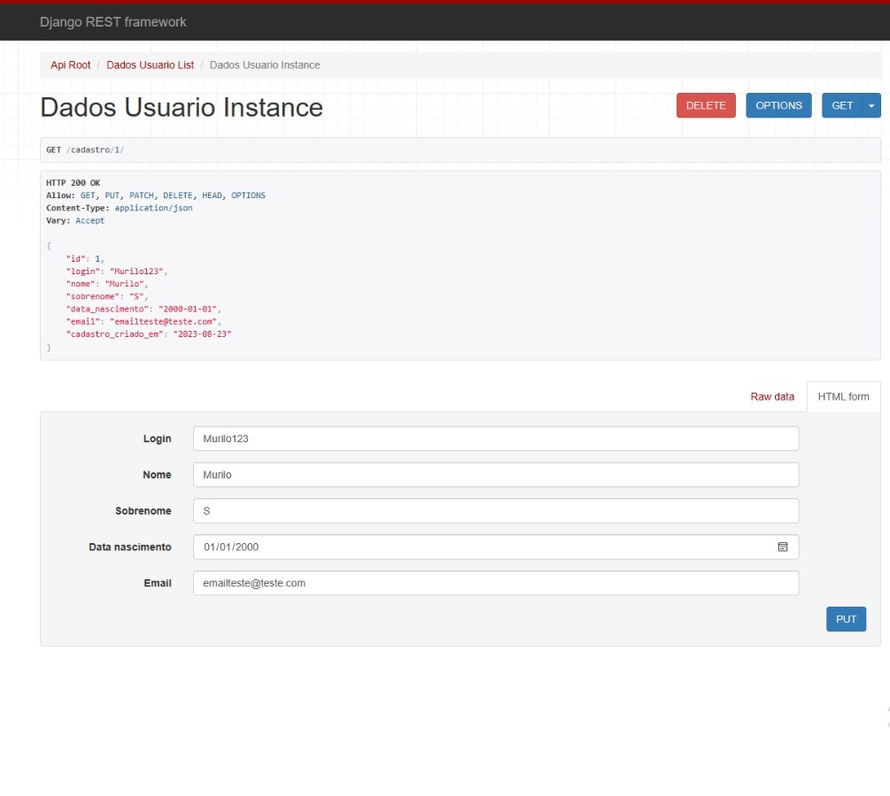

# API Rest de Cadastro de Usuários

Uma API Rest desenvolvida com Django e Django Rest Framework para gerenciar dados de usuários, incluindo login, nome, sobrenome, data de nascimento e email.

## Imagens

#### Cadastro usuarios


#### Erro Email ja existente


#### Editar dados



## Funcionalidades

- Listagem de usuários cadastrados
- Cadastro de novos usuários
- Atualização de informações de usuário
- Exclusão de usuários

## Tecnologias Utilizadas

- Python
- Django
- Django Rest Framework
- SQLite (Banco de Dados)

## Configuração do Ambiente

Siga estas etapas para configurar o ambiente e executar o projeto localmente:

```bash
# Clone o repositório
git clone https://github.com/MuriloSM/API_Cadastro
cd cadastro_usuarios

# Instale as dependências
pip install -r requirements.txt

# Realize as migrações do banco de dados
python manage.py migrate

# Inicie o servidor de desenvolvimento
python manage.py runserver 
```

## Endpoints da API
Listagem de Usuários: GET /cadastro/
Cadastro de Usuário: POST /cadastro/
Detalhes do Usuário: GET /cadastro/{id}/
Atualização de Usuário: PUT /cadastro/{id}/
Exclusão de Usuário: DELETE /cadastro/{id}/

## Exemplo de Requisição (JSON)

{
    "id": 1,
    "login": "Murilo123",
    "nome": "Murilo",
    "sobrenome": "S",
    "data_nascimento": "2000-01-01",
    "email": "emailteste@teste.com",
    "cadastro_criado_em": "2023-08-23"
}

## Contribuindo
Contribuições são bem-vindas! Sinta-se à vontade para enviar pull requests com melhorias ou correções.